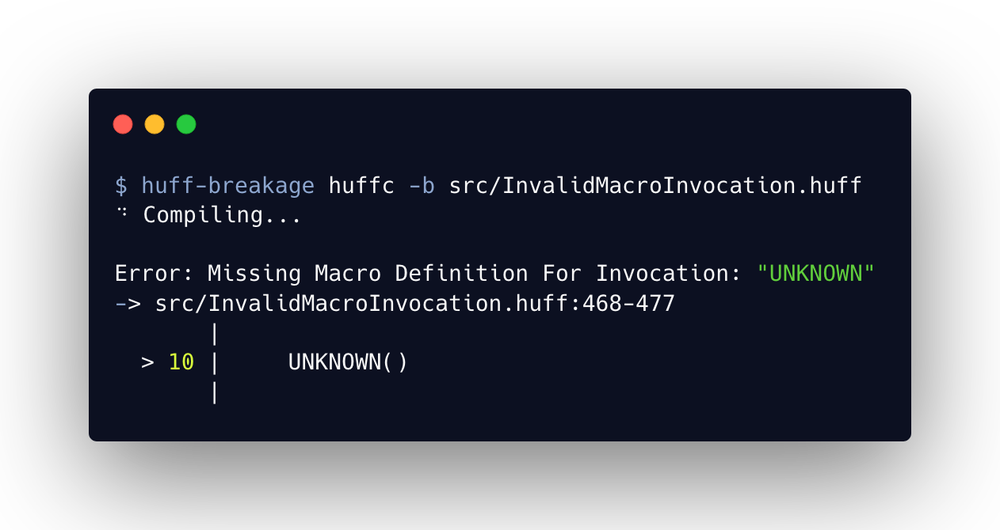
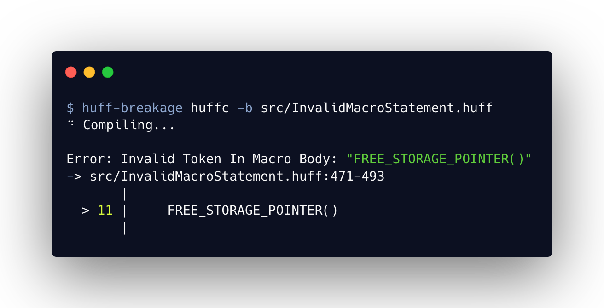

# huff-breakage • [](https://github.com/huff-language/huff-breakage/actions/workflows/ci.yaml) [](https://opensource.org/licenses/Apache-2.0) 

A set of **Incorrect**, **Breaking**, and **Footgunned** [Huff](https://github.com/huff-language) Contracts.

## Overview

[huff-breakage](https://github.com/huff-language/huff-breakage) contains many contracts that demonstrate incorrect usage of the [Huff Language](https://huff.sh).

To reproduce contract errors, make sure `huffc` is installed by running:
```bash
curl -L get.huff.sh | bash
# `source ~/.bashrc` OR `source ~/.zshrc` OR `source ~/.profile`
huffup
```

Then, compile a given contract to view the error message. For example, to view an invalid macro invocation error, run `huffc -b ./src/InvalidMacroInvocation.huff`, which will produce output similar to:
```bash
Error: Missing Macro Definition For Invocation: "UNKNOWN"
-> src/InvalidMacroInvocation.huff:468-477
       |
  > 10 |     UNKNOWN()
       |
```


## Contracts

_NOTE: Some of the below contracts compile correctly and have a `[COMPILES]` postfix_

```ml
src
├─ InvalidMacroInvocation — An invocation of a macro that doesn't exist
├─ InvalidMacroStatement — An invalid statement in a macro definition
├─ MissingConstantDef — A constant definition is missing
├─ MissingConstructor — A constructor macro definition is missing [COMPILES]
├─ TableBuiltins — Table Builtins created on deployment [COMPILES]
├─ UnmatchedJumpLabel — A jump label that has no matching label definition
```

## Examples

<details>
<summary>Invalid Macro Invocation</summary>
<br />
On line 10 of <a href="./src/InvalidMacroInvocation.huff">InvalidMacroInvocation.huff</a>, we invoke a macro called <code>UNKNOWN</code>, but it doesn't exist in either the <code>InvalidMacroInvocation</code> Huff contract or any of its imports (there are none in this simple example).

Thus, the compiler will generate an error message like so when compiling the contract:
<p align="center">

</p>
</details>

<details>
<summary>Invalid Macro Statement</summary>
<br />
On line 11 of <a href="./src/InvalidMacroStatement.huff">InvalidMacroStatement.huff</a>, we make a call to the <code>FREE_STORAGE_POINTER()</code> keyword which is invalid within the context of a macro.

Thus, the compiler will generate an error message like so when compiling the contract:

<p align="center">

</p>
</details>


## Safety Notice

This is **experimental software** and is provided on an "as is" and "as available" basis.

We **do not give any warranties** and **will not be liable for any loss** incurred through any use of this codebase.


## Installation

To install with [**Foundry**](https://github.com/foundry-rs/foundry):

```sh
forge install huff-language/huff-breakage
```

To install with [**Hardhat**](https://github.com/nomiclabs/hardhat) or [**Truffle**](https://github.com/trufflesuite/truffle):

```sh
npm install @huff-language/huff-breakage
```


## Acknowledgements

- [huff-rs](https://github.com/huff-language/huff-rs)
- [huffmate](https://github.com/huff-language) _SOON_
- [huff-examples](https://github.com/huff-language/huff-examples)
